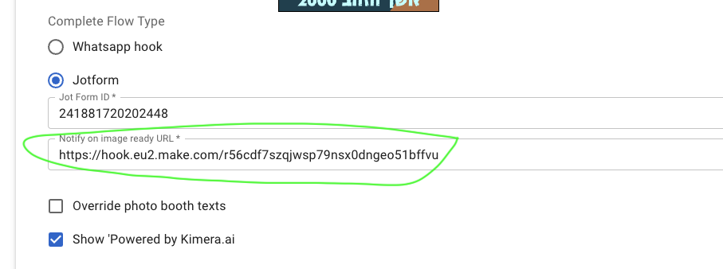

## Request Notificationy

### Description
When an image request is made, you have the option to notify an endpoint or any registered email recipient associated with the request. This feature is useful for scenarios where the request process concludes with filling out a form and capturing user details. These details are saved to the request, allowing you to send the request results to the user at a later time. The provided URL will be triggered upon the completion of the request process, using a predefined payload.

### How to use it
1. Enter the endpoint URL on the event form.
2. Ensure that your flow captures and stores the user's name and email as part of the request.




### Request payload
The payload will be sent as a POST request with the content type 'application/json'. An example payload is provided below:
```json
{
  "name": "Recipient's Full Name",
  "email": "Recipient's Email",
  "event_name": "Event Name",
  "logo": "Link to Event Logo Image",
  "source": "Link to Captured Request Image",
  "result": "Link to Request Result Image",
  "video": "Link to Request Result Video (if available)",
  "client_link": "Link to a Page with Request Results"
}
```